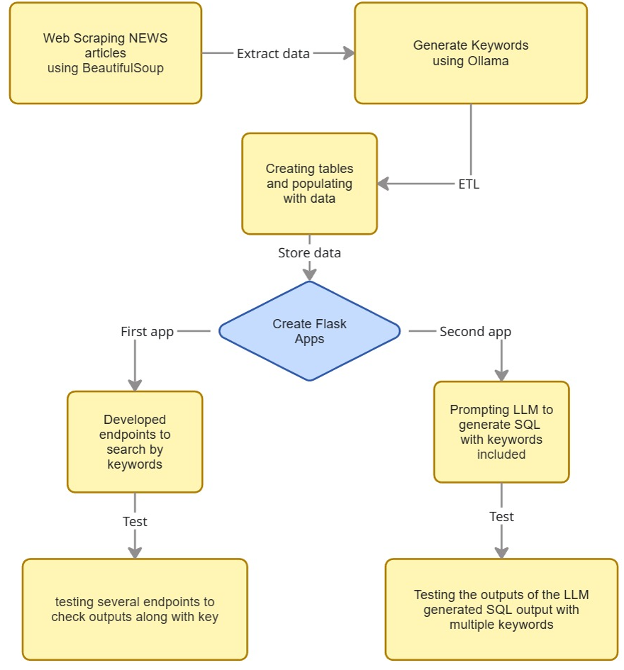
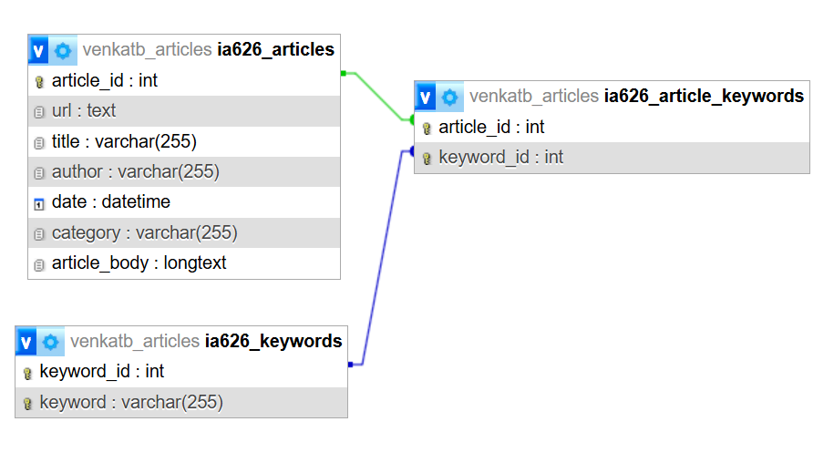

# IA626_FinalProject_venkatb_pammics

## Project Title: NEWS API using Flask and LLM models


### Project Team Members
- **Venkata Bhavana Tangirala**
- **Chaitanya Sai Pammi**


## Table of Contents

1. [Project Overview](#project-overview)
2. [Web Scraping](#web-scraping)
3. [Using Ollama to Generate Keywords](#using-ollama-to-generate-keywords)
4. [ETL Pipeline](#etl-pipeline)
5. [Flask API Approach A: Direct SQL Query API](#flask-api-approach-a-direct-sql-query-api)
6. [API Approach B: LLM-Generated SQL Search API](#flask-api-approach-b-llm-generated-sql-search-api)
7. [Test Clients](#test-clients)
8. [How to Replicate This Project](#how-to-replicate-this-project)
9. [Future work](#future-work)
20. [Conclusion](#conclusion)

# Project Overview

<p align="center">
  
</p>


This project implements an end-to-end automated news processing and retrieval system.  
The workflow begins by web-scraping news articles from online sources and extracting structured
information such as URL, title, author, published date, article body, and category.

Once the raw articles are collected, they are passed through an Ollama-hosted Large Language
Model (Mistral-Instruct) to generate a set of high-level conceptual keywords for each article.
These keywords capture the underlying themes, entities, and ideas present in the text, enabling
more meaningful search and retrieval.

All article details and generated keywords are then loaded into a MySQL database through a
custom ETL pipeline that handles table creation, dropping, insertion, and data transformation.

The project provides two different search API approaches, both implemented with Flask:

1. **Approach 1:** SQL-driven search using predefined queries to retrieve articles based on  
   keyword, author, category, date, or random selection.

2. **Approach 2:** LLM-generated SQL, where the API uses Ollama to produce the SQL query  
   dynamically based on the user’s input.

Both approaches return consistent JSON responses including execution time, query details,  
result counts, and matching article data. Dedicated test client scripts are also provided  
to demonstrate how to interact programmatically with each API version.

Overall, this system forms a complete pipeline from data collection → AI-driven keyword  
generation → database storage → searchable API endpoints, enabling fast and intelligent  
exploration of large news datasets.


# Web Scraping

The project begins with the collection of news articles through a controlled and compliant
web-scraping pipeline. Before scraping, we verified that the target website allows automated
access to its RSS feeds and public article pages. Only content that is explicitly permitted
for automated retrieval was collected, ensuring full adherence to robots.txt policies and
ethical scraping standards.

The scraping workflow uses Python libraries such as `requests`, `feedparser`, and
`BeautifulSoup` and follows these steps:

1. **Category Page Crawling & Link Discovery** – The scraper collects publicly accessible article links by navigating the news site’s category pages (e.g., Politics, World, US, Business).
For each category, the system iterates through the site’s paginated HTML endpoints and parses the returned pages using BeautifulSoup. From these pages, the scraper extracts valid article links by identifying category-specific `<a>` elements. Only publicly available, non-restricted links are collected, ensuring compliant and ethical data retrieval.
2. **Article Extraction** – For each article link collected from the category pages, the scraper retrieves and processes only publicly accessible portions of the article. The system extracts core metadata such as the title, author, publication date, category, and visible article body text. No restricted pages, paywalled content, or blocked sections are accessed, ensuring compliant and ethical data collection.

3. **HTML Parsing & Cleaning** – Using BeautifulSoup, the scraper extracts structured
   components such as:
   - URL  
   - Title  
   - Author  
   - Published Date  
   - Category  
   - Article body text (only the visible, non-restricted content)

4. **Ethical and Controlled Retrieval** – The scraper respects server load by using
   polite request intervals and avoids unnecessary repeated hits to the same URL.

5. **Output Storage** – All extracted article metadata is stored in a structured CSV file,
   forming the input for the LLM keyword generation and ETL phases.

By validating scraping permissions and collecting only publicly accessible article content,
the project ensures compliance, transparency, and responsible data acquisition throughout
the scraping process.


# Using Ollama to Generate Keywords

After collecting the raw news articles via web scraping, the next stage of the pipeline
focuses on enriching each article with high-level conceptual keywords. This is done using
a locally hosted Large Language Model (LLM) running through **Ollama**, specifically the
`mistral:instruct` model.

Other Ollama models such as deepseek-coder were tested early in the project but not used because they did not consistently generate valid JSON or high-level conceptual tags required for automated processing. deepseek-coder tended to produce code-like outputs, add explanations, or ignore the strict formatting rules needed for database ingestion. Larger models (e.g., Mixtral, Llama3-70B) were also avoided due to slower performance and no meaningful accuracy improvement for our workflow. So we proceeded to use mistral:instruct as our ollama model

For this project, **keyword generation was intentionally performed only on a selected subset
of scraped articles**. The purpose was to validate the workflow, test prompt design,
and demonstrate end-to-end integration without processing the full dataset.

### Workflow

1. **Input Preparation**  
   Each selected article is represented using its core fields:
   - Title  
   - Article body text  
   - Category (if available)

   These fields are combined into a structured prompt and sent to the LLM.

2. **Batch Processing with Ollama**  
   Articles are processed in batches using Python and the Ollama API. For each batch, the script:
   - Sends a clear instruction prompt to `mistral:instruct`  
   - Requests a list of conceptual tags in strict JSON array format  
   - Ensures deterministic output that can be parsed programmatically  

3. **Prompt Design**  
   The prompt encourages the model to:
   - Produce **high-level conceptual tags** rather than surface-level keywords  
   - Avoid raw emotion words or placeholder labels  
   - Represent themes (e.g., “immigration policy tension”, “economic risk sentiment”)  
   - Generate a fixed number of tags (e.g., 5–10 per article)
   ### Sample Prompt Used for Keyword Generation

```text
You are a keyword extraction system.

Your task is to read the article text and generate a list of single-word keywords
that represent the main themes of the article.

Rules:
- Only output single words (no phrases).
- Do not output emotion labels or placeholders.
- Do not output stopwords (e.g., "the", "and", "is").
- Produce 5–10 meaningful keywords.
- Output the final result ONLY as a JSON array.

Article:
{{ARTICLE_TEXT}}
```

4. **JSON Parsing and Validation**  
   The LLM output is:
   - Extracted using JSON-safe patterns  
   - Validated to ensure well-formed arrays  
   - Stored as `article → tags` mappings for the subset of processed articles  

5. **Storage for ETL**  
   The generated tags are saved into a CSV/JSON file for loading into the database.  
   The ETL normalizes tags into many-to-many relational tables to support efficient querying.

By applying Ollama to a **limited, controlled sample of articles**, the project demonstrates how
LLM-based keyword enrichment can be integrated into a scalable news-processing workflow.
This step validates feasibility, ensures output quality, and provides structured metadata for
API-based search operations.
### Sample Model Output (Generated Keywords for One Article)

Below is an example of the short, single-word (or minimal) keywords produced by the model for a sample article:

```json
[
    "immigration",
    "security",
    "policy",
    "government",
    "enforcement",
    "borders"
]
```


# ETL Pipeline

<p align="center">
  
</p>


The ETL pipeline converts the scraped article data and LLM-generated keywords into a clean,
search-ready MySQL database. Only a subset of articles (used for testing) was processed.

---

### 1. Extract
Two input files are loaded:

- **Articles CSV** – URL, title, author, date, category, body.  
- **Keywords file (CSV/JSON)** – article_id → list of single-word keywords.

---

### 2. Transform
Key transformations include:

- **Cleaning article fields** – trimming text, normalizing date formats, ensuring valid encoding.  
- **Normalizing keywords** – lowercasing, removing duplicates or empty values.  
- **Lookup dictionary creation** –  
  A mapping is built to assign each unique keyword a `keyword_id`


- **Article–keyword mapping** –  
Using the lookup, a table of `(article_id, keyword_id)` pairs is created to represent
the many-to-many relationship.

---

### 3. Load
The transformed data is inserted into three MySQL tables.

### Table: ia626_articles

| Column       | Type           | Description               |
|--------------|----------------|---------------------------|
| article_id   | INT PK         | Auto-increment ID         |
| url          | TEXT           | Article URL               |
| title        | VARCHAR(255)   | Title                     |
| author       | VARCHAR(255)   | Author                    |
| date         | DATETIME       | Publication date          |
| category     | VARCHAR(255)   | Article category          |
| article_body | LONGTEXT       | Full article text         |

---

### Table: ia626_keywords

| Column     | Type           | Description             |
|------------|----------------|-------------------------|
| keyword_id | INT PK         | Unique keyword ID       |
| keyword    | VARCHAR(255)   | Normalized keyword      |

---

### Table: ia626_article_keywords

| Column     | Type     | Description                                   |
|------------|----------|-----------------------------------------------|
| article_id | INT FK   | References `ia626_articles(article_id)`       |
| keyword_id | INT FK   | References `ia626_keywords(keyword_id)`       |

---

### Summary
The ETL pipeline:

- Cleans article metadata  
- Normalizes and deduplicates keywords  
- Uses a lookup dictionary to create consistent keyword IDs  
- Loads everything into a relational schema optimized for fast API search  

This structured database powers both search approaches implemented in Flask.


# Flask API Approach A: Direct SQL Query API
In this approach, the API communicates directly with the MySQL database using predefined SQL
queries. Each endpoint performs a specific search operation such as filtering by keyword,
author, category, publication date, or returning a random article.  
All searches are deterministic and fast because they rely entirely on structured SQL queries.

Users must supply an API key for endpoints that fetch data.

Below is a summary of all available endpoints in Approach 1:

---

### Endpoint Summary Table

| Endpoint Name | Example Call | Method | Notes |
|---------------|--------------|--------|-------|
| **Root** | `http://127.0.0.1:5000/` | GET | Returns a basic message confirming the API is running. No key required. |
| **ByKeyword** | `http://127.0.0.1:5000/ByKeyword?keyword=Emotions&key=testkey` | GET / POST | Returns articles matching the given keyword. Only one keyword is allowed per request. |
| **ByAuthor** | `http://127.0.0.1:5000/ByAuthor?name=Bonny%20Chu&key=testkey` | GET / POST | Returns articles written by the specified author (supports partial matches). |
| **ByDate** | `http://127.0.0.1:5000/ByDate?date=2025-12-03&key=testkey` | GET / POST | Returns articles published on a specific date. Date must use the format **YYYY-MM-DD**. |
| **ByCategory** | `http://127.0.0.1:5000/ByCategory?cat=Politics&key=testkey` | GET / POST | Returns articles from the specified category. |
| **ByRandom** | `http://127.0.0.1:5000/ByRandom?key=testkey` | GET / POST | Returns a single random article from the database. |


### Endpoints with key

- `/ByKeyword?keyword=&key=`
- `/ByAuthor?name=&key=`
- `/ByDate?date=YYYY-MM-DD&key=`
- `/ByCategory?cat=&key=`
- `/ByRandom?key=`

### Endpoints without a key

- `/ByKeyword?keyword=`
- `/ByAuthor?name=`
- `/ByDate?date=YYYY-MM-DD`
- `/ByCategory?cat=`
- `/ByRandom`

 

### Response Format
```json
{
    "req": "ByKeyword",
    "sqltime": 0.0123,
    "code": 1,
    "msg": "ok",
    "num_results": 3,
    "results": [
        {
            "article_id": 101,
            "url": "https://example.com/article-1",
            "title": "Sample article title 1"
        },
        {
            "article_id": 102,
            "url": "https://example.com/article-2",
            "title": "Sample article title 2"
        },
        {
            "article_id": 103,
            "url": "https://example.com/article-3",
            "title": "Sample article title 3"
        }
    ]
}


```
# Flask API Approach B: LLM-Generated SQL Search API

In this approach, the API uses an LLM (via Ollama running `mistral:instruct`) to dynamically
generate SQL queries based on user-provided keywords.  
Instead of predefined SQL statements, the model analyzes the input term, produces additional
related terms, and returns a fully formed SQL query that the API executes.

This approach demonstrates how natural-language-driven database querying can work using a local LLM.

Only **one keyword** is provided by the user; the LLM expands it into related terms and
constructs a SQL query that searches across article titles, keywords, and content.

All endpoints require a key


---

### Endpoint Summary Table (Approach 2)
### Endpoint Summary Table

| Endpoint | Method | Example Request | Description |
|----------|--------|------------------|--------------|
| **/** | GET, POST | `http://127.0.0.1:5000/` | Root endpoint for API health-check. Returns a JSON message confirming the API is running. |
| **/runQuery** | GET | `http://127.0.0.1:5000/runQuery?q=angry&key=testkey` | Validates the API key, accepts a keyword via `q`, generates an LLM-powered SQL query, executes it, and returns matching article records in JSON format. |


---

### How Approach 2 Works

1. **User provides a search term**  
   Example: `q=angry`

2. **LLM expands the search query**  
   The model generates 5 related single-word keywords (e.g., “anger”, “upset”, “frustration”…).

3. **LLM produces a SQL statement**  
   The prompt instructs the model to return ONLY a SQL query string.

4. **API executes the model-generated SQL**  
   The SQL runs against the relational database and retrieves article URLs that match the
   semantic meaning of the input.

5. **Response returned to user**  
   endpoints  `runQuery` return structured JSON output.

---

### Sample JSON Response (Approach 2 – `/runQuery`)

```json
{
    "req": "runQuery",
    "code": 1,
    "msg": "ok",
    "sql": "SELECT url FROM ia626_articles WHERE title LIKE '%angry%' OR body LIKE '%anger%' LIMIT 10;",
    "results": [
        "https://www.example.com/article/12",
        "https://www.example.com/article/44",
        "https://www.example.com/article/51"
    ],
    "sqltime": 0.0421
}
```


This version uses Ollama to generate SQL queries dynamically.

### Workflow
1. User sends a natural-language query  
2. Flask passes it to the LLM  
3. LLM generates a SQL SELECT statement  
4. SQL is executed and returned in the standard JSON format  

### Example user queries
- "articles about economic slowdown"
- "news discussing government policy decisions"
- "technology leadership issues"

This enables flexible natural-language search.

# Test Clients

Two test scripts verify the APIs.

### test_client_sql.py
- Sends requests to SQL endpoints  
- Prints the JSON response  

### test_client_ollama.py
- Sends natural-language queries  
- Validates LLM-generated SQL  

Both clients measure response times and ensure correctness.

# How to Replicate This Project 

## 1. Web Scraping Using Our Script
webscraping.ipynb

This script performs direct HTML scraping.  
It visits category pages such as:
https://www.articles.com/category/politics?page=1

It extracts:
- URL
- Title
- Author
- Date
- Category
- Article body

It saves all scraped articles into a CSV or JSON file.

------------------------------------------------------------

## 2. Generate Keywords Using Ollama
Install Ollama:
https://ollama.com/download

Pull models:
ollama pull mistral:instruct
ollama pull llama3.1

Start Ollama:
ollama serve

Generate keywords:
ollama_tag_generation.ipynb

## 3. Populate MySQL Tables (ETL Script)
database.ipynb
This script inserts data into:
- ia626_articles
- ia626_keywords
- ia626_article_keywords

------------------------------------------------------------
## 4. Run the Flask API approach 1
python app1.py

API URL:
http://127.0.0.1:5000/

Example endpoints:

http://127.0.0.1:5000/ByKeyword?key=your_key&keyword=security

http://127.0.0.1:5000/ByAuthor?key=your_key&name=John

http://127.0.0.1:5000/ByCategory?key=your_key&cat=Politics

http://127.0.0.1:5000/runQuery?key=your_key&q=military


## 5.Run the flask api approach 2
python app2.py

API URL:
http://127.0.0.1:5000/

example endpoints

http://127.0.0.1:5000/runQuery?q=angry&key=testkey

http://127.0.0.1:5000/runQuery?q=chicago&key=testkey


------------------------------------------------------------

## 5. Run the Test Clients
Approach 1:
python client1.py

Approach 2:
python client2.py

------------------------------------------------------------

## Future Work
- Integrate a vector embedding model for semantic search
- Add pagination and filtering features to API endpoints
- Build a full UI dashboard for article exploration
- Automate daily scraping and database updates
- Enhance keyword extraction with multi-word keyphrases
- Add sentiment analysis and topic classification
- Deploy the API on cloud services such as AWS or Render
- Improve SQL generation with validation and safety checks
- Add user authentication using JWT instead of key-based access

------------------------------------------------------------

## Conclusion

This project successfully demonstrates a complete end-to-end pipeline for transforming raw online news articles into a searchable and intelligent data system. Starting with HTML-based web scraping, articles are collected, cleaned, and enriched with conceptual keywords generated using local LLM models through Ollama. The ETL pipeline organizes all information into a relational MySQL database, enabling flexible querying and exploration.

Two search approaches were implemented: direct SQL queries through Flask API endpoints and dynamic SQL generation using an LLM for semantic search. Together, these components provide both traditional and AI-assisted retrieval capabilities.

This system forms a strong foundation for more advanced applications such as semantic search, topic modeling, recommendation systems, dashboards, and large-scale automated news analytics.


